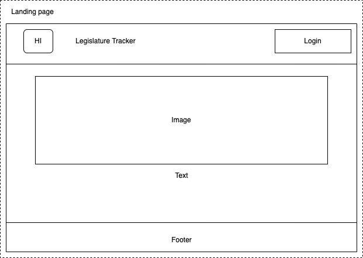
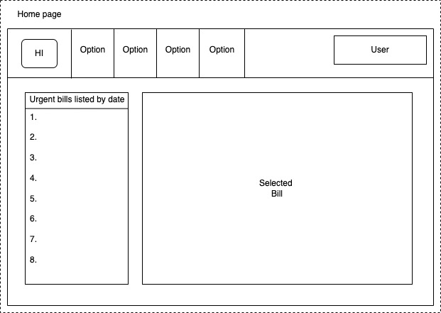
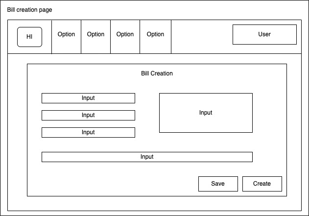
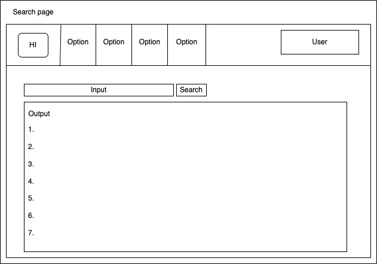

# Legal ED HI

## Table of contents

* [Overview](#overview)
* [Mockup Pages](#mockup-pages)
* Deployment (coming soon)
* User Guide (coming soon)
* Developer Guide (coming soon)
* Development History(coming soon)
* Continuous Integration(coming soon)
* [Team](#team)

## Overview

The purpose of this project is to provide a tool for the Hawaii Department of Education that facilitates the passing of state legislature.

Some of the main functions of this tool will be:

* To provide real-time tracking of legislative measures.
* Notifying the relevant people/offices when action from them must be taken.
* Automating tasks such as document creation and updating.
* Provide the ability to search measures by key parameters and keywords.
* Track changes to documents and allow for easy comparison of different versions.

This application will help to streamline the legislative process and prevent measures from accidentally being retired due to disorganization or miscommunication.

## Mockup Pages

This section provides a mockup pages for the Legal ED HI user interface and its capabilities.

### Landing Page

The landing page is presented to users when they visit the top-level URL to the site.

### Home page

After logging in, you are taken to the home page, which presents a list of urgent bills sorted by date on the left as well as a bigger overview of a selected bill in the center:

### Bill creation page

The Bill creation page will provide the authorized user to freely create a new bill with proper inputs: 

### Search page

The search page will provide the authorized user to search the bill with the keywords:

## Team

* [Lise Marie Nilsen](https://github.com/lisemnilsen)
* [Zachary Gilbert](https://github.com/zakgilbert)
* [Steven Le](https://github.com/sle417)
* [YongSung Masuda](https://github.com/yongsungm)
* [Hyunjun Song](https://github.com/eric-song1773)
* [William Liang](https://github.com/William-Liang808)
* [Kristine Rivera](https://github.com/tineriver)
* [Cathy Kim](https://github.com/cathy-kim95)

