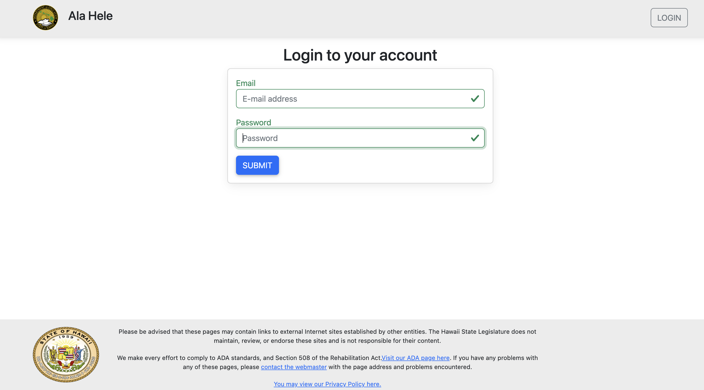
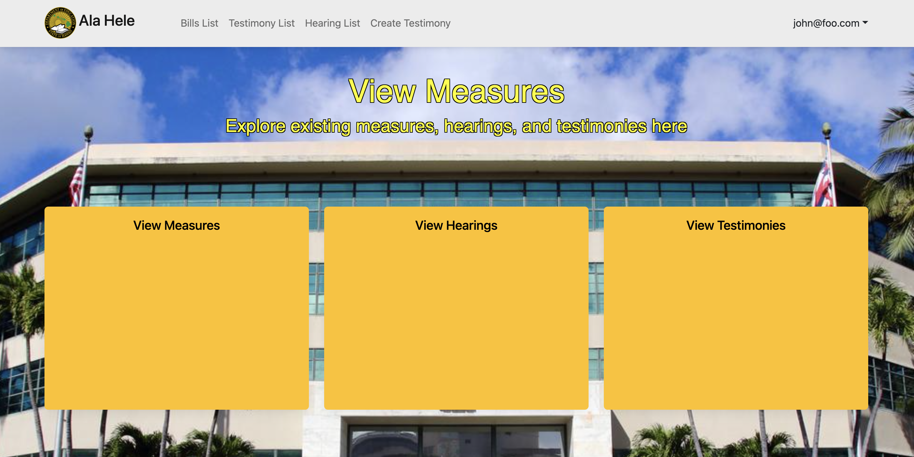
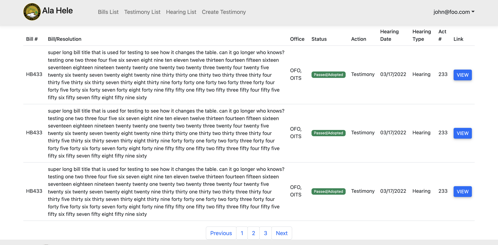
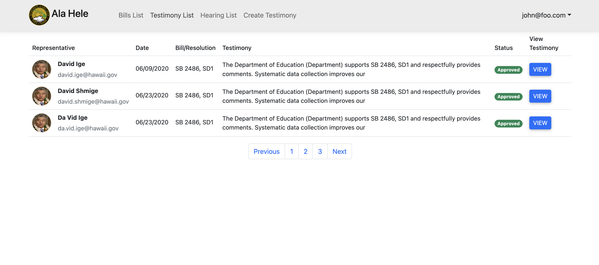
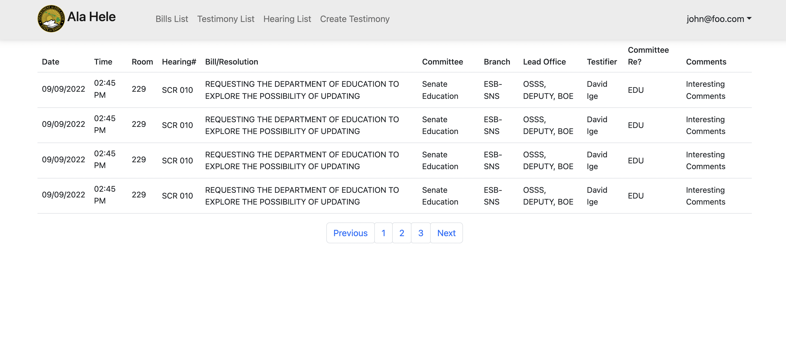
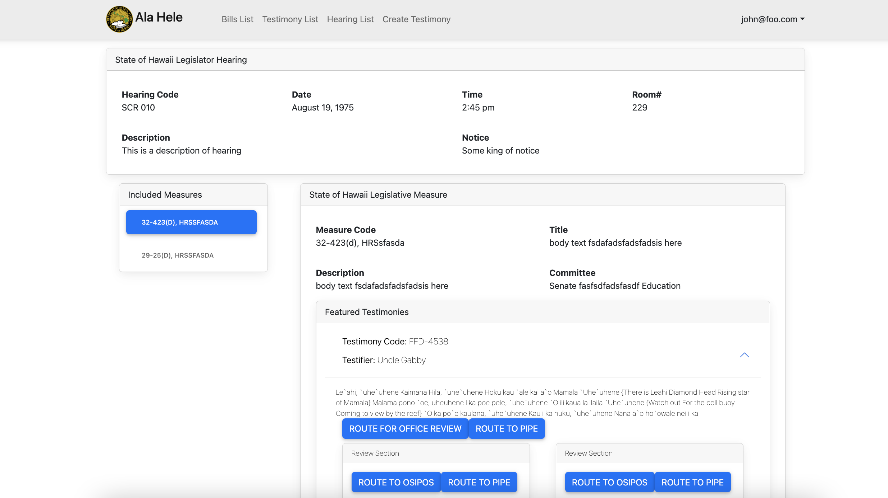
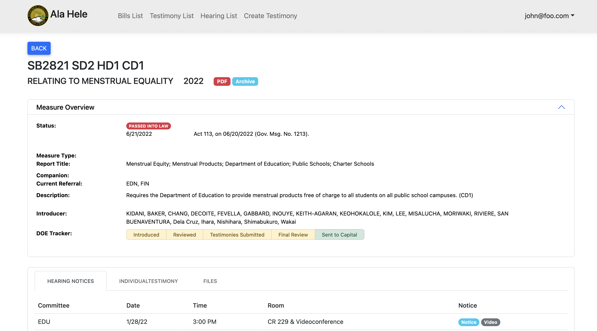
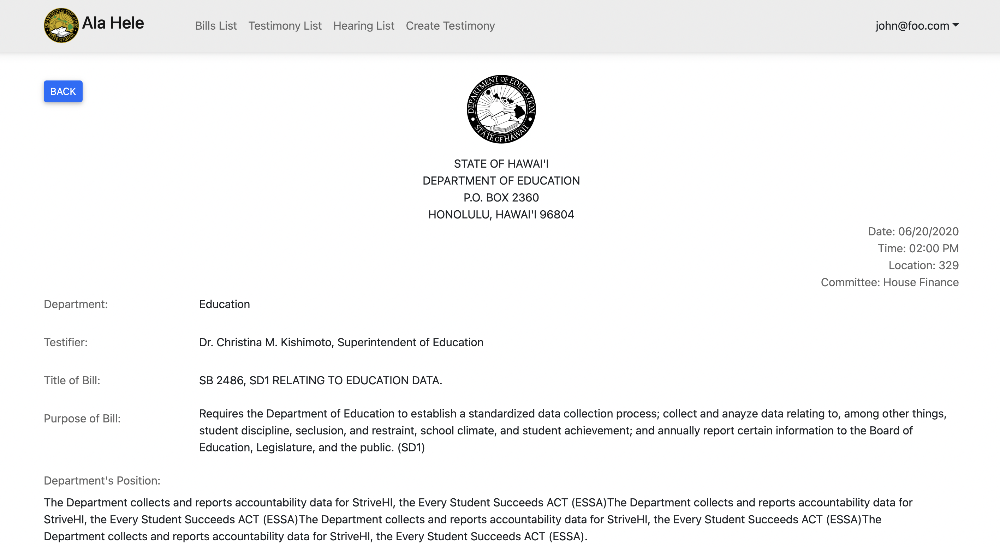
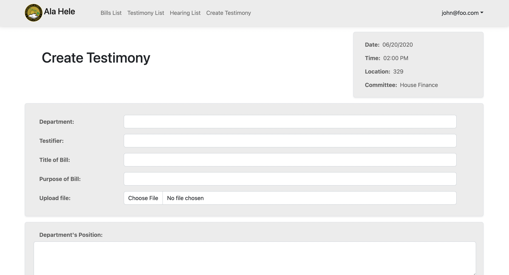
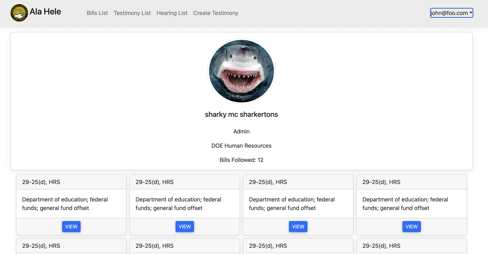

# Ala Hele

## Table of contents

* [Overview](#overview)
* [Mockup Pages](#mockup-pages)
* Deployment (coming soon)
* User Guide (coming soon)
* Developer Guide (coming soon)
* Development History(coming soon)
* Continuous Integration(coming soon)
* [Team](#team)

## Overview

The purpose of this project is to provide a tool for the Hawaii Department of Education that facilitates the passing of state legislature.

Some of the main functions of this tool will be:

* To provide real-time tracking of legislative measures.
* Notifying the relevant people/offices when action from them must be taken.
* Automating tasks such as document creation and updating.
* Provide the ability to search measures by key parameters and keywords.
* Track changes to documents and allow for easy comparison of different versions.

This application will help to streamline the legislative process and prevent measures from accidentally being retired due to disorganization or miscommunication.

## Mockup Pages

This section provides a mockup pages for the Ala Hele user interface and its capabilities.

### Landing Page

### Login Page

### Homepage

### Bill List Page

### Testimony List Page

### Hearing List Page

### Individual Hearing Page

### Individual Bill Page

### Testimony Page

### Create a Testimony Page

### User Profile Page

## Team

* [Lise Marie Nilsen](https://github.com/lisemnilsen)
* [Zachary Gilbert](https://github.com/zakgilbert)
* [Steven Le](https://github.com/sle417)
* [Hyunjun Song](https://github.com/eric-song1773)
* [William Liang](https://github.com/William-Liang808)
* [Kristine Rivera](https://github.com/tineriver)
* [Cathy Kim](https://github.com/cathy-kim95)

